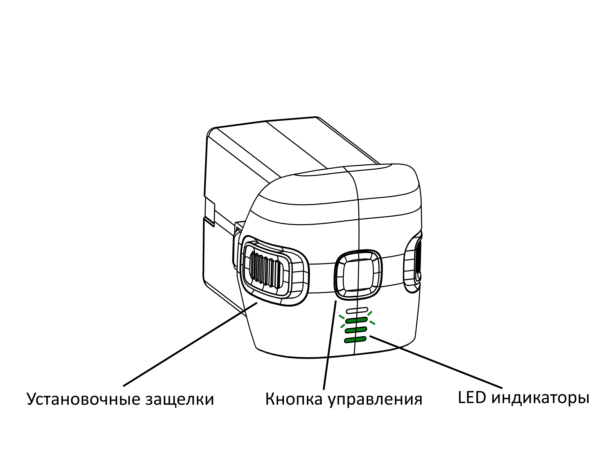
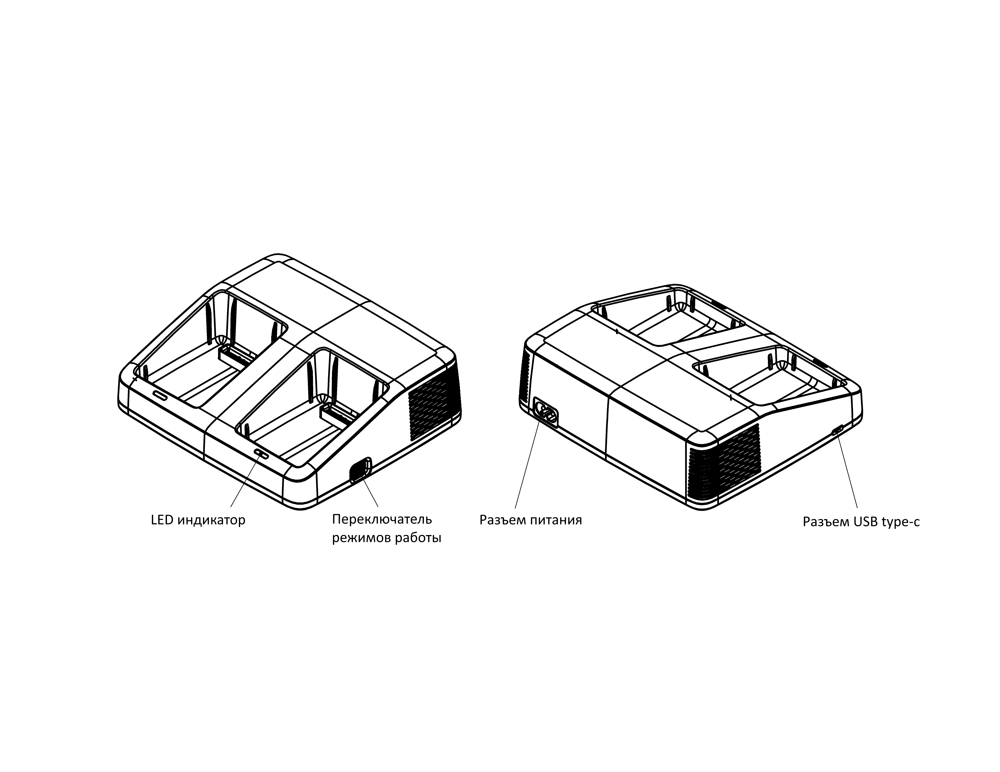
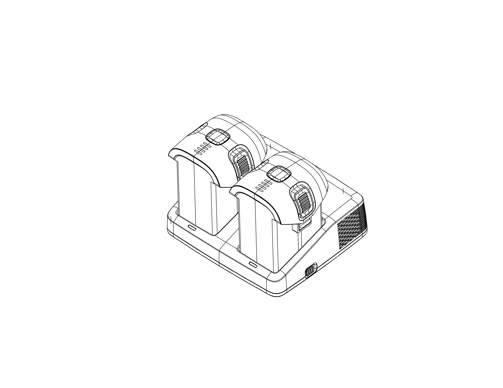

Зарядная станция и АКБ
=========================

Характеристики АКБ
--------------------

Аккумуляторная батарея

+---------------------------------+------------------+
| Тип аккумулятора                | Li-Ion 6S        |
+---------------------------------+------------------+
| Напряжение                      | 22,2 В           |
+---------------------------------+------------------+
| Емкость                         | 6000 мА•ч        |
+---------------------------------+------------------+
| Энергия                         | 129,6 Вт•ч       |
+---------------------------------+------------------+
| Масса                           | 680 г            |
+---------------------------------+------------------+
| Рабочий диапазон температур     | от ˗15 до +40 °C |
+---------------------------------+------------------+
| Диапазон температур при зарядке | от 0 до +40 °C   |
+---------------------------------+------------------+

Управление АКБ
----------------------

Нажмите на кнопку управления, чтобы вывести уровень заряда АКБ на индикаторы. После нажатия светодиодные индикаторы отобразят уровень заряда зелеными делениями, каждое деление соответствует 25% полного заряда. Мигающий индикатор показывает, что эти 25% заряда на исходе. 

Чтобы включить или выключить АКБ, нажмите и отпустите кнопку управления, затем повторно нажмите и удерживайте её 4-5 секунд. Статус батареи отображается на индикаторах. 

.. note:: Выключение батареи может занимать до 30 секунд. При этом не нужно удерживать кнопку нажатой. 

Правила эксплуатации Li-Ion АКБ
------------------------------------------------------
Для безопасной и эффективной эксплуатации батареи соблюдайте следующие требования:

.. * Если полеты проходят при температуре воздуха ниже 0 °C, перед полетом необходимо хранить АКБ в теплом месте и не допускать её охлаждения. Следует помнить, что на холоде Li-Ion АКБ могут терять до 30% своей емкости. Это необходимо учитывать при построении полетного задания;
.. * Если полеты проходят при температуре воздуха свыше 25 °C, перед полетом необходимо хранить АКБ в прохладном, защищенном от попадания прямых солнечных лучей месте. 

* Не заряжайте АКБ сразу после полета, чтобы не допустить перегрева.
* Не допускайте разгерметизации и деформации элементов АКБ (не ронять, не прокалывать, не разбирать).
* Не допускайте нагрева АКБ свыше 60 градусов.
* Не допускайте перезаряда АКБ (свыше 23 В).
* Не допускайте глубокого разряда АКБ.
* Не храните АКБ в разряженном состоянии. При длительном хранении (месяц и более) необходимо перевести АКБ в режим хранения. 
* Несоблюдение вышеперечисленных указаний может привести к возгоранию или полному выходу АКБ из строя.

Хранение и разряд
-------------------

**Хранение**

Если вы не планируете использовать АКБ в следующие 14 и более дней, переведите её в режим хранения. Для этого подключите АКБ к зарядному устройству и переведите переключатель режимов на боковой панели в положение **"Хранение"**. Убедитесь, что оба индикатора ЗУ мигают зеленым цветом. После этого установите АКБ в ЗУ - индикаторы на ЗУ должны начать плавно пульсировать красным цветом. 

.. attention:: Короткое мигание индикаторов красным цветом (без АКБ) свидетельствует о неисправности ЗУ. В этом случае следует отключить зарядное устройство от сети питания, дождаться, пока индикаторы погаснут, и повторно включить зарядное устройство. При повторении ошибки сообщите о ней в `службу технической поддержки <https://www.geoscan.aero/ru/support>`_.

.. Оптимальная температура — от 5 до 10 °С. 

Срок хранения - 1 год. По истечении срока хранения АКБ необходимо полностью зарядить, а затем снова перевести в режим хранения.

Утилизация АКБ
-----------------

**Не выбрасывайте Li-Ion батареи в контейнеры для бытового мусора.** 
Неправильная утилизация отработавших источников питания может представлять опасность для окружающей среды.
Утилизируйте Li-Ion батареи в соответствии с местным законодательством, сдавая их в ближайшие пункты переработки. 

Зарядное устройство
---------------------

   Вид и элементы управления зарядного устройства

Зарядное устройство предназначено для работы с АКБ Геоскан Gemini. 

Конструкция зарядного устройства позволяет установить в него одновременно две АКБ, но заряжаться они будут по очереди. Сначала будет заряжаться та батарея, для зарядки которой требуется меньше времени (имеющая при установке в зарядное устройство больший остаточный заряд). Во время зарядки индикаторы на АКБ показывают её текущий уровень заряда, а индикатор на зарядном устройстве светится красным. По завершении заряда он сменит цвет на зеленый, а индикаторы на АКБ погаснут. 

   Подключение аккумуляторных батарей к зарядному устройству

Характеристики ЗУ
---------------------

+-----------------------------------------+------------------------+
| Габаритные размеры                      | 145×163×51 мм          |
+-----------------------------------------+------------------------+
| Масса                                   | 475 гр                 |
+-----------------------------------------+------------------------+
| Входное напряжение AC                   | 220 В                  |
+-----------------------------------------+------------------------+
| Потребляемая мощность                   | 130 Вт                 |
+-----------------------------------------+------------------------+
| Зарядный ток                            | 5 А                    |
+-----------------------------------------+------------------------+
| Время заряда одной АКБ (до 90% емкости) | 1 час                  |
+-----------------------------------------+------------------------+
| Защита блока питания                    | Циклическое отключение |
+-----------------------------------------+------------------------+
| Защита от перенапряжения                | Отключение устройства  |
+-----------------------------------------+------------------------+
| Защита по температуре                   | Отключение устройства  |
+-----------------------------------------+------------------------+
| Рабочая температура                     | от 0 до +40 °C         |
+-----------------------------------------+------------------------+
| Допустимая влажность                    | 85%                    |
+-----------------------------------------+------------------------+

Правила эксплуатации ЗУ
----------------------------

* Перед подключением АКБ к зарядному устройству необходимо предварительно включить зарядное устройство. 
* Перед каждым использованием необходимо производить осмотр кабеля и разъемов на предмет повреждений. Не используйте поврежденный кабель и разъемы для зарядки АКБ. 
* Запрещается эксплуатировать зарядное устройство под прямыми солнечными лучами.
* Запрещается эксплуатировать зарядное устройство без присмотра.

