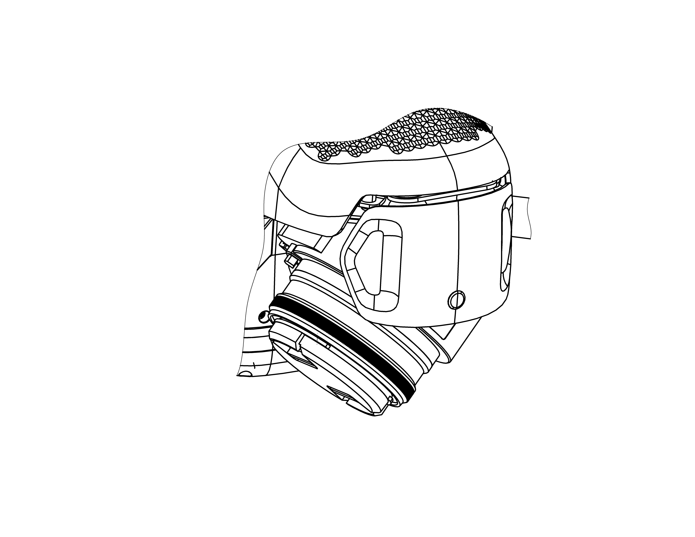
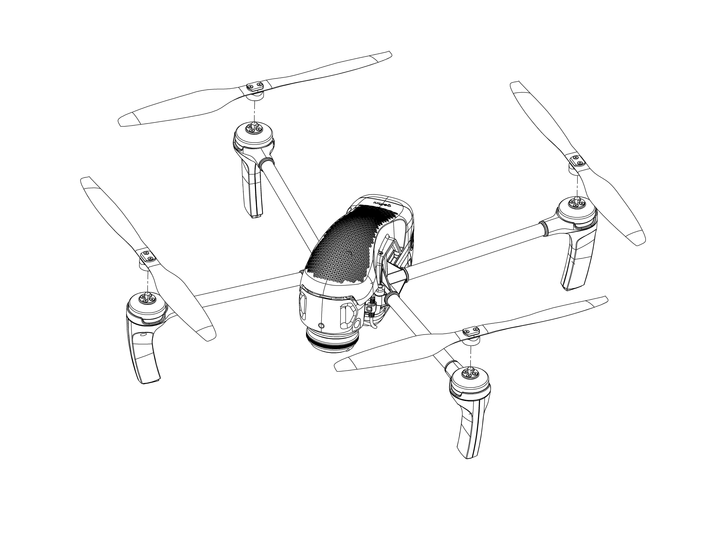

Запуск
=========

Чтобы запустить Геоскан Gemini, последовательно выполните пункты инструкции:

1) Зарядите АКБ (см. :doc:`charger`).
2) Спланируйте полетное задание, используя Geoscan Planner (см. :doc:`planner`). Сохраните полетное задание, чтобы быстро загрузить его перед вылетом. 
3) При необходимости установите фиксированный угол наклона камеры. Для этого поверните объектив вокруг продольной оси аппарата по часовой стрелке как показано на рисунке. Придерживайте фронтальную часть БВС. Возможно два фиксированных угла наклона: 24° и 48°. 

   поворот камеры на фиксированный угол

4) Отформатируйте SD карту памяти и установите ее в слот в задней части БВС. Убедитесь что карта надежно зафиксирована в слоте и извлекается только при повторном нажатии. 

.. figure:: _static/_images/sdcard.PNG
   :align: center
   :width: 600

   Установка карты памяти

5) *Установите воздушные винты на оси моторов БВС. Обратите внимание, что винты отличаются по направлению вращения. Используйте цветовую маркировку на лопастях винтов и основаниях моторов, они должны совпадать.* 

   Установка воздушных винтов

6) Установите АКБ в отсек БВС. Активируйте подачу питания. Для этого нажмите кнопку управления на АКБ один раз, отпустите и сразу же снова зажмите и удерживайте её 4-5 секунд. Снимите крышку объектива. 

.. figure:: _static/_images/cam_lid.PNG
   :align: center
   :width: 600

   Не забудьте снять крышку с объектива камеры перед полетом

7) Установите БВС на взлётную площадку и убедитесь, что воздушные винты свободно вращаются. 
8) Откройте полетное задание в Geoscan Planner. Запустите мастер предстартовой подготовки. Убедитесь в успешном прохождении предстартовой подготовки. 
9) Нажмите на кнопку **Старт** в окне Geoscan Planner. 

БВС осуществит взлет и начнет выполнение полетного задания. 

Порядок разборки БВС
========================

1) Деактивируйте АКБ так же как при включении (одно короткое и одно длинное нажатие кнопки управления). Извлеките АКБ из отсека БВС. 
2) Открутите гайки крепления воздушных винтов и снимите их вместе с шайбами. Снимите воздушные винты и уложите их в транспортировочный кейс. 
4) Извлеките SD карту памяти из слота БВС. 
