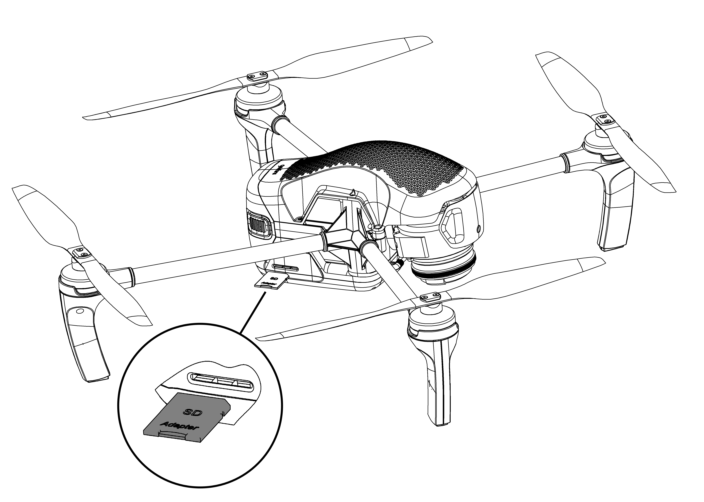
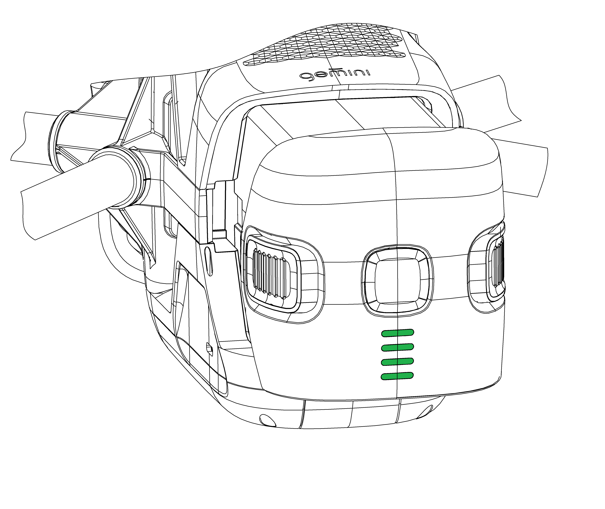
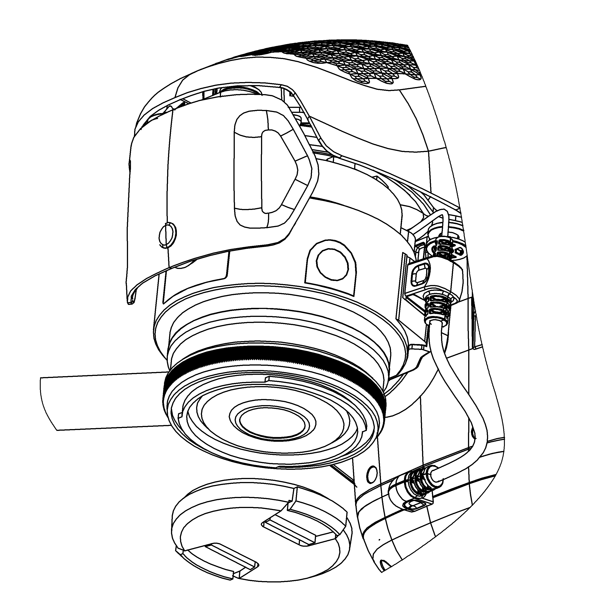

Запуск
=========

Чтобы запустить Геоскан Gemini, последовательно выполните пункты инструкции:

1) Зарядите АКБ (см. :doc:`charger`).
2) Спланируйте полетное задание, используя Geoscan Planner (см. :doc:`planner`). Сохраните полетное задание, чтобы быстро загрузить его перед вылетом. 

3) *Установите воздушные винты на оси моторов БВС. Обратите внимание, что винты отличаются по направлению вращения. Используйте цветовую маркировку на осях моторов и винтов, они должны совпадать.* 

.. figure:: _static/_images/props12.png 
   :align: center
   :width: 600

   Установка воздушных винтов

4) Отформатируйте SD карту памяти и установите ее в слот в задней части БВС. Убедитесь что карта надежно зафиксирована в слоте и извлекается только при повторном нажатии. 

   Установка карты памяти

5) Установите АКБ в отсек БВС. Активируйте подачу питания одним коротким и одним длинным нажатием кнопки управления. 

   Установка АКБ в отсек БВС 

6) Перед началом полета снимите крышку объектива. 

   Не забудьте снять крышку с объектива камеры 

7) Установите БВС на взлётную площадку и убедитесь, что воздушные винты свободно вращаются. 
8) Откройте полетное задание в Geoscan Planner. Запустите мастер предстартовой подготовки. Убедитесь в успешном прохождении предстартовой подготовки. 
9) Нажмите на кнопку **Старт** в окне Geoscan Planner. 

БВС осуществит взлет и начнет выполнение полетного задания. 

Порядок разборки БВС
========================

1) Деактивируйте АКБ так же как при включении (одно короткое и одно длинное нажатие кнопки управления). Извлеките АКБ из отсека БВС. 
2) Снимите воздушные винты и уложите их в транспортировочный кейс. 
3) Извлеките SD карту памяти из слота БВС. 
