Использование Geoscan Planner
==============================

Предварительная настройка
-----------------------------------

1) Подключите модем КРЛ к USB порту ноутбука.
2) Включите бортовое питание БВС.
3) Запустите программу **MdmDisp**.

В правом нижнем углу появится пиктограмма антенны и количество подключенных бортов.

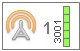

   Индикатор работы программы MdmDisp

3.1 При первом подключении необходимо настроить соединение с БВС, запустив программу **NetTopology**:

* Нажмите на значок **Поиск новых устройств**.

.. figure:: _static/_images/planner29.png
   :align: center
   :width: 200

   Значок поиска новых устройств

Программа отобразит список обнаруженных модемов.

.. note:: Эфир сканируется до тех пор, пока кнопка **Поиск новых устройств** не будет нажата повторно.

* Выберите появившийся Борт №xxx и нажмите на значок **Добавить устройство**.

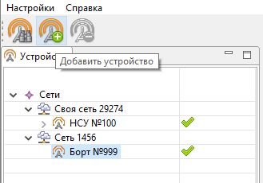

   Значок добавления устройства

Программа сохраняет список добавленных устройств.

При проведении повторных полетов достаточно запустить **MdmDisp** и убедиться, что подключение выполнено успешно.

Если БВС не обнаружен, запустить поиск бортовых модемов, нажав на значок **MdmDisp** правой кнопкой мыши и выбрав **Переподключить**.

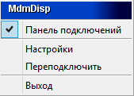

   Контекстное меню MdmDisp

4) Запустите программу **Geoscan Planner**.
5) В окне ввода логина и пароля введите свой логин и пароль пользователя продукта.
6) Во вкладке **Полет** выберите **Подключить БВС - Поиск...**.*

.. figure:: _static/_images/planner3.png
   :align: center
   :width: 500

   Подключение БВС

7) Выбрать тип подключения **MdmDisp**. Задать **IP-адрес** *localhost*. В списке **Борт** установить для **БВС - Порт 2**.

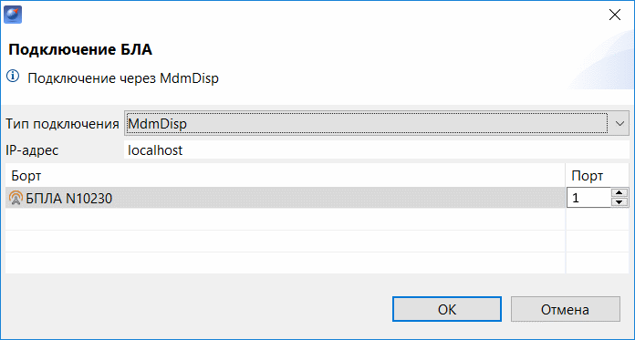

   Окно подключения БВС

.. note:: Параметры достаточно установить один раз. При последующих подключениях БВС воспользуйтесь кнопкой **Подключить БВС** панели инструментов. Приемник автоматически определит координаты и отобразит местоположение БВС на карте. В окне программы появятся панель телеметрии (слева) и панель приборов (справа).

.. figure:: _static/_images/pl5.png
   :align: center
   :width: 500

   Подключение БВС

Проектирование полетного задания
----------------------------------------

1) Создайте **Новый проект**.

.. figure:: _static/_images/planner5.png
   :align: center
   :width: 400

   Создание нового проекта

Укажите имя проекта, параметры съемки, модель БВС и фотоаппарата.

.. figure:: _static/_images/planner7.png
   :align: center
   :width: 500

   Создание нового проекта полетного задания

Площадная аэрофотосъемка
-------------------------------------------
Площадная аэрофотосъемка – съемка полигонов. Полигон – это область, ограниченная многоугольником. Оператор задает вершины многоугольника (не менее 3), а программа автоматически рассчитывает маршрут обхода.

1) Нажмите на значок **Создать площадную аэрофотосъемку** панели инструментов.

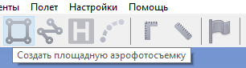

   Создание площадной аэрофотосъемки

2) Щелчками кнопки мыши задайте на карте угловые точки исследуемого участка местности. Программа автоматически рассчитает маршрут обхода полигона.

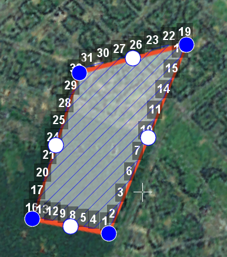

   Пример построения площадной аэрофотосъемки

Добавление и удаление вершин полигона
__________________________________________

В готовый полигон можно добавлять вершины.

1) С зажатой левой кнопкой мыши переместите среднюю точку стороны полигона.

.. figure:: _static/_images/planner10.png
   :align: center
   :width: 350

   Добавление вершины

Вершина будет создана автоматически. 
В плавающем окне рядом с вершиной отобразятся ее координаты.

.. figure:: _static/_images/planner45.png
   :align: center
   :width: 350

   Результат добавления вершины

Для удаления вершины:

1) нажмите на вершину правой кнопкой мыши;
2) в контекстном меню выберите **Удалить вершину**.

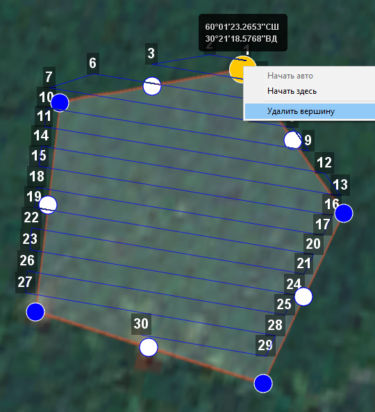

   Удаление вершины

Изменение направления линий облета
_______________________________________
Необходимость оптимизировать полигон «по направлению» возникает, например, если на месте проведения работ сила и направление ветра неблагоприятны (сильный ветер вдоль линий облета полигона).
Для изменения типа оптимизации щелкните правой кнопкой мыши на полигоне и выберите в контекстном меню вариант **Оптимизация «направление»**.

.. figure:: _static/_images/planner11.png
   :align: center
   :width: 500

   Оптимизация по направлению

Одна из вершин полигона будет подсвечена. На ней появится бегунок для задания направления.

.. figure:: _static/_images/planner12.png
   :align: center
   :width: 500

   Корректировка направления облета

В результате будет построен новый маршрут облета полигона по заданному направлению.

.. figure:: _static/_images/planner13.png
   :align: center
   :width: 500

   Новый маршрут облета

Изменение точки входа
________________________

Если необходимо сменить точку входа в полигон, то выполните следующие действия:

1) Выделите полигон.

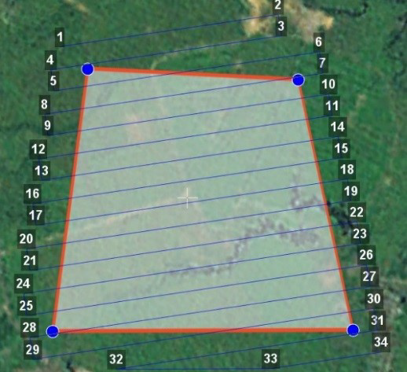

   Выделенный полигон

2) Правой кнопкой мыши выделите точку, в которой нужно осуществить вход. 
3) В появившемся контекстном меню выберите **Начать здесь**.

.. figure:: _static/_images/planner15.png
   :align: center
   :width: 500

   Изменение точки входа в полигон

.. |flag| image:: _static/_images/flag.png
    :width: 50

У выбранной точки входа появится флажок |flag|

Линейная аэрофотосъемка
---------------------------
Команда **Создать линейную аэрофотосъемку** служит для облета линейных протяженных объектов, таких как: реки, дороги, нефтепроводы и т.п..

1) Нажмите на значок **Создать линейную аэрофотосъемку** панели инструментов.

.. figure:: _static/_images/planner16.png
   :align: center
   :width: 500

   Создание области линейной аэрофотосъемки

2) Однократными щелчками задайте маршрут обхода протяженного объекта по точкам разворотов. Программа автоматически построит линии облета.

.. figure:: _static/_images/planner17.png
   :align: center
   :width: 500

   Пример линейной аэрофотосъемки

Полет по точкам
-------------------
Команда **Создать полет по точкам** может использоваться для обследования территорий или облета высотных объектов.

1) Нажмите на значок **Создать полет по точкам** на панели инструментов.

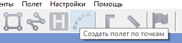

   Значок создания полета по точкам

2) Однократными щелчками задайте маршрут полета по точкам.

.. figure:: _static/_images/planner32.png
   :align: center
   :width: 500

   Задание маршрута полета по точкам

.. note:: По умолчанию фотографирование во время полета по точкам не осуществляется. При необходимости настройте **Режим фотографирования** в панели **Свойства**.

* Щелчком правой кнопки мыши по точке вы можете задать время "зависания" БВС. Выберите **Задать задержку в точке** и укажите время в секундах.

Точка ожидания
------------------------
Команда **Создать точку ожидания** служит для удержания БВС в точке на высоте заданное время.

1) Нажмите на значок **Создать точку ожидания** на панели инструментов.

.. figure:: _static/_images/planner22.png
   :align: center
   :width: 500

   Значок создания точки ожидания

2) Щелчком мыши на карте задайте точку, в которой должно осуществляться ожидание.

.. figure:: _static/_images/planner24.png
   :align: center
   :width: 500

   Точка ожидания на карте

БВС будет на заданной высоте «удерживать» точку в течение указанного времени, после чего отправится по запланированному маршруту.

В экспертном режиме (см. полное руководство Geoscan Planner) можно изменить свойства: задать высоту точки ожидания, длительность ожидания, направление движения и активировать функции измерения ветра и бесконечного ожидания.

При активации варианта **Измерение ветра**. При этом точка ожидания окрасится в желтый цвет, а длительность измениться на 15с. Квадрокоптер, учитывая измеренные данные о ветре, будет плавнее идти по маршруту полетного задания.

Функция бесконечного ожидания служит для постоянного удержания точки (пока не сработает отказ по низкому заряду АКБ, приводящий к автоматическому возврату). При этом цвет точки ожидания изменится на темно-синий.

.. attention:: Рекомендуется устанавливать точку ожидания с измерением ветра перед каждым полетным элементом на высоте полетного элемента. Если элементы полетного задания находятся на значительном удалении, рекомендуется дополнительно провести измерение ветра рядом с этим полетным элементом.
.. attention:: Комплексы Геоскан не являются сертифицированными приборами измерения ветра, поэтому не могут быть использованы в качестве надежных источников данных о состоянии окружающей среды.

Точка посадки
------------------
Команда **Создать точку посадки** служит для указания места приземления БВС.

При отсутствии заданной точки посадки БВС по окончанию полетного задания вернется в точку старта.

1) Нажмите на значок **Создать точку посадки** на панели инструментов.

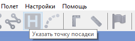

   Значок создания точки посадки

2) Щелчком мыши укажите точку приземления БВС.

Предстартовая подготовка
----------------------------

1) Запустите **Мастер предстартовой подготовки**.

   Запуск мастера предстартовой подготовки

Следуйте указаниям мастера предстартовой подготовки (большинство проверок выполняются автоматически).
Задайте время автономного полета (время, в течение которого осуществляется полет независимо от наличия связи между НСУ и БВС) и высоту возврата после выполнения полетного задания или окончания времения автономного полета.

.. attention:: Высота возврата должна быть такой, чтобы гарантировать отсутствие препятствий.

Полет
----------------------------

1) Нажмите на значок **Старт**.

   Значок старта

Убедитесь, что ничего не мешает вращению лопастей и подтвердите запуск двигателей.

.. figure:: _static/_images/planner35.png
   :align: center
   :width: 400

   Подтверждение запуска двигателей

Автопилот проверит работу двигателей. На экране НСУ появится окно подтверждения взлета.

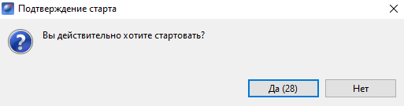

   Подтверждение взлета

БВС осуществит взлет.

.. note:: БВС выполняет полет в автоматическом режиме, однако это не освобождает оператора от обязанностей по наблюдению за процессом полета. Постоянное наличие связи по радиолинии не является необходимым для успешного выполнения задания.

Возврат
----------
Команда **Возврат** отправляет борт к стартовой точке. Достигнув положения напротив стартовой точки на высоте, БВС выполняет посадку.

1) Нажмите на значок **Возврат**.

.. figure:: _static/_images/planner37.png
   :align: center
   :width: 250

   Значок возврата БВС

Посадка
---------
Команда **Посадка** служит для выполнения снижения и немедленной посадки.

1) Нажмите на значок **Посадка**.

   Значок посадки БВС

.. attention:: Автоматическое замедление при посадке срабатывает по барометрической высоте. Не рекомендуется указывать точку посадки в месте, сильно отличающемся по высоте рельефа от места взлета.

Полет по требованию
---------------------
Команда **Полет по требованию** позволяет отправить БВС на указанную точку на карте (с указанием высоты).
По достижении указанной точки БВС начнет удержание данной точки, пока оператор не вмешается в выполнение полетного задания, либо пока не сработает автоматический возврат по отсечке батареи.

1) Нажмите на значок **Полет по требованию**.

.. figure:: _static/_images/planner39.png
   :align: center
   :width: 300

   Значок полета по требованию

2) Укажите точку на карте и задайте высоту полета над землей (Превышение).

.. figure:: _static/_images/planner40.png
   :align: center
   :width: 300

   Задание высоты полета по требованию

По достижении точки БВС будет удерживать указанные координаты.

.. figure:: _static/_images/planner41.png
   :align: center
   :width: 400

   Пример полета по требованию

Дистанционное управление
---------------------------

Активация режима дистанционного управления возможна после прохождения предстартовой подготовки и взлета.

1) Нажмите на Значок **Дистанционное управление**.

.. figure:: _static/_images/planner42.png
   :align: center
   :width: 200

   Значок дистанционного управления

.. attention:: При активации ручного режима БВС прервет выполнение задания по площадной или линейной АФС. После отключения ручного режима выполнение будет продолжено.

Будет осуществлен переход в ручной режим управления.

По умолчанию дистанционное управление осуществляется через **Управление скоростями**. В таком случае выполняется векторный контроль отклонений кнопками в окне
дистанционного управления или клавиш:

.. figure:: _static/_images/planner43.png
   :align: right
   :width: 200

   Окно дистанционного управления

* **W** – полет прямо по курсу (вперед)
  
* **A** — изменить направление полета в левую сторону (влево)
  
* **S** — полет в обратную сторону относительно курса (назад)
  
* **D** — изменить направление полета в правую сторону (вправо)
  
* **T** — набор высоты (вверх)
  
* **G** — снижение (вниз)
  
* **[** – изменить курс в левую сторону (вращение влево)
  
* **]** – изменить в правую сторону (вращение вправо)

